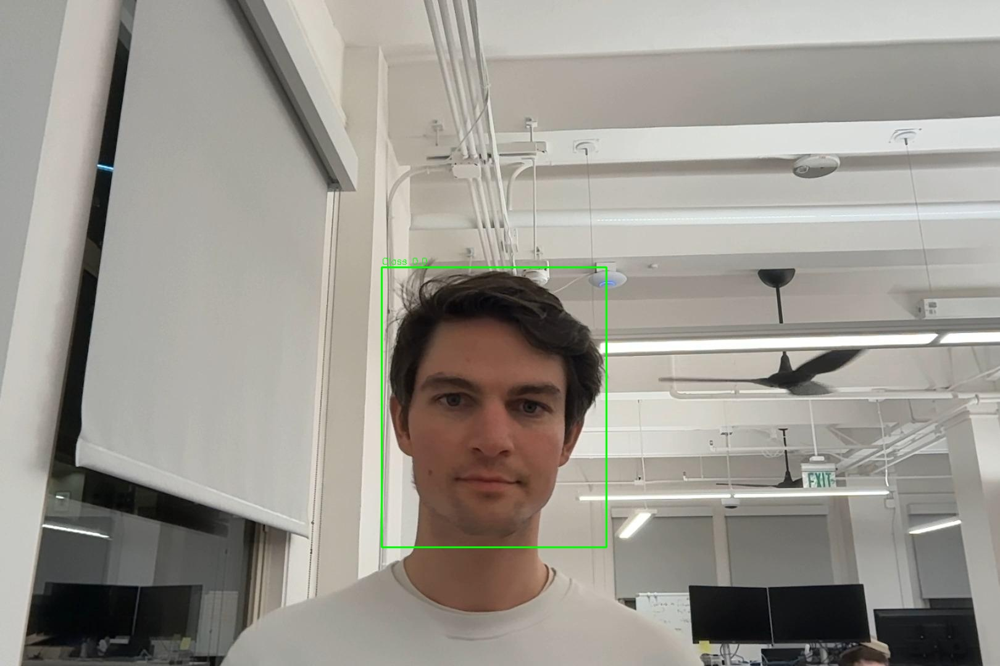
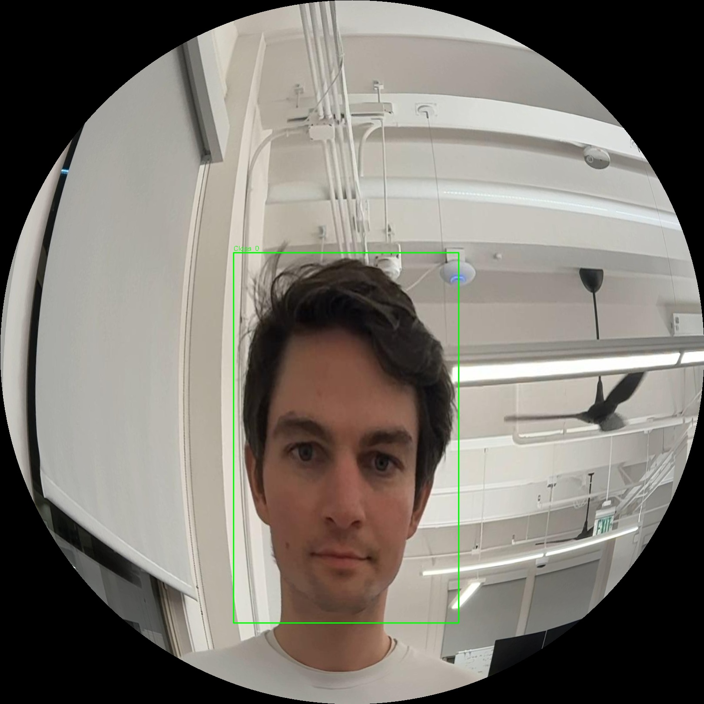
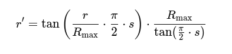

# Fisheye Dataset Transformer

      


## 📌 Introduction
This repository provides a script to transform a YOLO dataset from **Roboflow format** into a **fisheye dataset** by applying distortion transformations to both the images and their corresponding bounding boxes. This is useful when training object detection models on images captured by **fisheye cameras**, such as the **Intel RealSense T265**.
### Original Bounding Box
<p align="center">

</p>

### Fisheye Bounding Box
<p align="center">
    
</p>

## ⚙️ Prerequisites
Before running the dataset processing script, ensure you have the following dependencies installed:

### 🛠 Required Libraries
- **Python 3.x**
- **OpenCV** (`cv2`) for image processing
- **NumPy** for numerical operations

To install the required dependencies, run:
```bash
pip install opencv-python numpy
```

### 📂 Dataset Format
This script is designed to work with a **YOLO dataset structured in Roboflow format**. The dataset should follow this directory structure:

```
Dataset/
│── train/
│   ├── images/
│   │   ├── image1.jpg
│   │   ├── image2.jpg
│   ├── labels/
│   │   ├── image1.txt
│   │   ├── image2.txt
│
│── valid/
│   ├── images/
│   │   ├── image1.jpg
│   │   ├── image2.jpg
│   ├── labels/
│   │   ├── image1.txt
│   │   ├── image2.txt
│
│── test/
│   ├── images/
│   ├── labels/
│
└── data.yaml
```

### 📏 Image Requirements
- **All images must have the same dimensions** before applying the fisheye transformation.
- The labels should be in **YOLO format** (i.e., each `.txt` file must contain `[class_id, x_center, y_center, width, height]`).

## 🚀 How to Run
To process the dataset and apply the fisheye transformation, follow these steps:

### 1️⃣ Clone the repository
```bash
git clone https://github.com/RubenCasal/FishyFy.git
cd FishyFy
```

### 2️⃣ Run the processing script
Execute the `main.py` script, providing the input dataset directory, the output directory and the strength of the fisheye distortion for the transformed dataset:

```python
from process_dataset import process_roboflow_dataset


INPUT_DATASET = "./Face Detection dataset"
OUTPUT_DATASET = "./Fisheye Face Detection dataset"
DISTORTION_STRENGTH = 0.7 # [0-1] value

process_roboflow_dataset(INPUT_DATASET, OUTPUT_DATASET, DISTORTION_STRENGTH)

```

This will generate a new dataset where images and bounding boxes are adapted to the **fisheye perspective**.

## 🎥 How Images Are Transformed into Fisheye Format
Fisheye transformation is applied by distorting the image radially, simulating the effect of a wide-angle lens. The transformation follows these steps:

1. **Resizing to Square Format**
   - The image is first resized into a square before applying the transformation. This step ensures that pixel loss is minimized and that the transformation is applied uniformly in all directions.

2. **Applying Radial Distortion**
   - Each pixel in the image is remapped based on its distance from the center, creating a **barrel distortion effect**.
   - The transformation follows the mathematical model:
      <p align="center">
    
   </p>
   
     Where:
     - (r) is the original distance of a pixel from the center.
     - (R_max) is the maximum radius (half of the image width or height, whichever is smaller).
     - (s) is the strength of the fisheye effect.
     - (r') is the new remapped radius after distortion.
   
   - This equation increases the perceived distance of points farther from the center while keeping the central points relatively unchanged, mimicking the effect of a fisheye lens.

3. **Using a Lookup Table (LUT) for Optimization**
   - To speed up the transformation process, a **Lookup Table (LUT)** is precomputed before applying fisheye distortion.
   - The LUT stores the mapping between original and distorted pixel positions, significantly reducing the computational cost when transforming multiple images.
   - Instead of recalculating the distortion for every pixel in each image, the LUT allows direct indexing for efficient remapping.

4. **Circular Cropping Consideration**
   - The outer parts of the transformed image often turn black due to remapping outside the original image bounds. These areas are ignored during training.

This process ensures that images align with the **fisheye camera view**, making the dataset suitable for training models that operate in such environments.

## 🔄 Bounding Box Transformation
Since the objects in the image also undergo radial distortion, their bounding boxes need to be adjusted accordingly. The process includes:

1. **Remapping Bounding Box Coordinates**
   - The four corners of each bounding box are transformed using the same fisheye distortion applied to the image.
   - This transformation follows the radial distortion function to ensure consistency between the bounding box and the deformed object.

2. **Recalculating the Bounding Box Dimensions**
   - Due to the distortion, bounding boxes may expand or shrink depending on their position relative to the center of the image.
   - Objects near the edges tend to stretch outward, while those near the center retain their proportions.
   - A new bounding box is computed to encapsulate the distorted object as accurately as possible.

3. **Ensuring Bounding Boxes Remain Within the Circular Region**
   - Since the fisheye transformation introduces black borders outside the circular region, bounding boxes that extend beyond this area are clipped.
   - This prevents labels from containing invalid coordinates that fall outside the usable image space.
   - If a bounding box is significantly reduced or falls entirely outside the visible area, it is removed from the dataset to maintain labeling accuracy.

This ensures that YOLO receives correctly mapped labels that align with the distorted images, improving model accuracy when deployed with fisheye cameras.

## 🛠 Bounding Box Visualization Tool
A simple script is provided to help visualize whether bounding boxes have been correctly transformed. Users can test this on their own datasets.

### How to Use
```python
from generate_new_bboxes import draw_yolo_bboxes, load_yolo_bboxes
import cv2

image_path = "./input/image2.jpg"
label_path = "./input/label2.txt"
save_result_path = "./output/fisheye_bbox.jpg"

bbox = load_yolo_bboxes(label_path)
image = cv2.imread(image_path)
result_img = draw_yolo_bboxes(image, bbox)

cv2.imwrite(save_result_path, result_img)
```

### Purpose
- This script loads an image and its corresponding YOLO labels, then overlays the bounding boxes onto the image.
- It is useful for verifying that the bounding boxes have been properly transformed after applying the fisheye effect.
- Users can test this visualization tool on their own datasets to ensure correct label alignment.

## ⚠️ Limitations and Future Improvements
### Key Limitations
- A small percentage of pixels are lost due to the circular format of the fisheye transformation.
- Bounding boxes remain rectangular, which may not fully capture object dimensions in distorted areas.

### Future Improvements
- Implementing a method to preserve lost pixels while maintaining the circular format.
- Representing bounding boxes using alternative polygonal shapes to better capture object dimensions in fisheye images.

